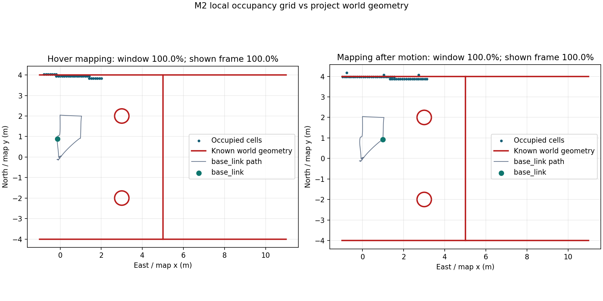
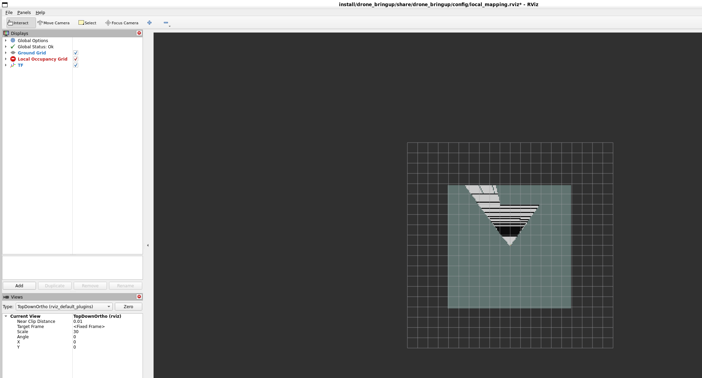

# ROS2 无人机自主巡检系统

中文 | [English](README.en.md)

基于 PX4、ROS 2 和 Gazebo 的无人机自主巡检项目。项目范围、架构和里程碑以 [`项目方案-ROS2无人机自主巡检系统.md`](项目方案-ROS2无人机自主巡检系统.md) 为准。

## 当前状态

当前里程碑：**M5 - 工程化收尾**。M0-M4 已验收；M4 的一键任务、结构化状态
日志、异常处理和不超过 3 分钟的 Gazebo + RViz2 双画面视频均有当前源码对应的
直接证据。M5 尚未验收。

M5 的候选工程化资产包括 `Dockerfile`、`compose.yaml`、GitHub Actions、统一
build/test/ament lint 门禁、英文 README、架构与模块说明、Docker 复现指南和
性能分析报告。
2026-08-24 已从当时的 133 个候选路径执行 `--no-cache --pull` Docker 构建，并用
新镜像完成工具冒烟和完整无界面 M4 Compose 回归。清除 3 个已归档的根目录过程便笺
并加强整洁门禁后，当时 130 个候选路径又通过本地统一 CI。仓库现已推送到 GitHub，
提交 `8dd4985` 的 Actions 运行 `32708449299` 已全绿，最终 131 个候选路径通过严格
整洁门禁。但该机器不是全新环境，且当前私有仓库因 GitHub 账户套餐限制无法启用
分支保护，因此仍不能宣称“全新机器 30 分钟复现”或“CI 全绿且 main 受保护”。
当前边界见
[`docs/m5-engineering-audit.md`](docs/m5-engineering-audit.md)。

Docker 可用时，从仓库根目录运行完整无界面 M4：

```bash
docker compose up --build --abort-on-container-exit --exit-code-from inspection
```

详细的独立计时、bag 验证和 GUI 步骤见
[`docs/reproduction-guide.md`](docs/reproduction-guide.md)，系统数据流与模块契约见
[`docs/architecture.md`](docs/architecture.md)。

全新机器验收计时必须在 `git clone` 前开始，并将该时间戳传给
`scripts/run_m5_reproduction.sh`。脚本要求保留 clone origin，拒绝既有项目镜像、
容器和旧 M4 bag，只分析本次唯一新增的 bag；写证据前会移除 origin 中的凭据等
敏感字段，本机 rehearsal 会固定标记为非验收候选。

2026-08-22 已在本机直接验收 M0 和 M1：除 PX4/Gazebo/ROS 2 基线外，
一条 launch 命令可完成起飞、4 个方形航点、返回起点和自动降落。
6 个稳定到达点的平均位置误差为 `0.127 m`；每个目标段最后 1 秒共 300 个
稳态样本的平均误差为 `0.119 m`，RMSE 为 `0.133 m`。
直接证据和口径限制见 [`docs/m0-environment-audit.md`](docs/m0-environment-audit.md)、
[`docs/m1-waypoint-audit.md`](docs/m1-waypoint-audit.md) 与
[`docs/m2-local-mapping-audit.md`](docs/m2-local-mapping-audit.md)。M3 当前证据与
限制见 [`docs/m3-path-planning-audit.md`](docs/m3-path-planning-audit.md)，M4 正式
证据与适用边界见 [`docs/m4-mission-audit.md`](docs/m4-mission-audit.md)。

## 固定版本

| 组件 | 版本 |
|---|---|
| Ubuntu | 22.04.5 LTS（WSL2） |
| ROS 2 | Humble |
| Gazebo | Harmonic 8.15.0 |
| PX4 Autopilot | v1.17.0 |
| px4_msgs | v1.17.0 |
| px4_ros_com | `86e9aeb20e55a4673fa8a9f1c29ea06a6c5ad1af` |
| Micro XRCE-DDS Agent | v2.4.3 |
| PlotJuggler | 3.17.2 |

版本锁定位于 [`dependencies.repos`](dependencies.repos)。不要单独升级其中一个 PX4 相关仓库。

## 仓库布局

```text
.
|-- .local/                  # 项目内工具与 Python 用户包（不提交）
|-- build/ install/ log/     # Colcon 输出（不提交）
|-- docs/
|-- external/                # PX4 与 Agent 外部源码（不提交）
|-- scripts/
|-- src/                     # Colcon 工作空间源码
`-- dependencies.repos
```

所有项目生成的下载、缓存、日志和临时文件均应留在仓库中；当前机器的 WSL VHD
因容量原因单独位于 `D:\codex-wsl\project19-Ubuntu-22.04`。`scripts/project-env.sh`
会隔离 Windows PATH，并将常见缓存和日志定向到项目目录。

## 从零搭建

以下步骤以 Windows PowerShell 当前目录为仓库根目录、仓库位于 E 盘为例。若路径不同，只需替换 WSL 中的仓库路径。

### 1. 安装项目 WSL

在 PowerShell 中执行：

```powershell
$wslLocation = "D:\codex-wsl\project19-Ubuntu-22.04"
wsl --install --distribution Ubuntu-22.04 --location $wslLocation
wsl -d Ubuntu-22.04
```

首次进入 Ubuntu 时完成用户名和密码初始化。之后在 Ubuntu 中进入仓库并建立稳定挂载点：

```bash
cd "/mnt/e/codex-work space/project19-无人机开发agent"
bash scripts/mount-project.sh
cd /opt/project19
```

WSL 完全停止后 bind mount 会消失；每次重新启动 WSL 后先再次运行 `scripts/mount-project.sh`。

### 2. 安装 ROS 2 Humble

```bash
sudo apt-get update
sudo apt-get install -y curl software-properties-common
sudo add-apt-repository -y universe

mkdir -p downloads
curl -fL --retry 5 --retry-all-errors --connect-timeout 15 \
  -o downloads/ros2-apt-source_1.2.0.jammy_all.deb \
  https://github.com/ros-infrastructure/ros-apt-source/releases/download/1.2.0/ros2-apt-source_1.2.0.jammy_all.deb
sudo apt-get install -y ./downloads/ros2-apt-source_1.2.0.jammy_all.deb

curl -fsSL --retry 5 --retry-all-errors --connect-timeout 15 \
  https://packages.osrfoundation.org/gazebo.gpg \
  -o downloads/pkgs-osrf-archive-keyring.gpg
sudo install -m 0644 downloads/pkgs-osrf-archive-keyring.gpg \
  /usr/share/keyrings/pkgs-osrf-archive-keyring.gpg
echo \
  "deb [arch=$(dpkg --print-architecture) signed-by=/usr/share/keyrings/pkgs-osrf-archive-keyring.gpg] http://packages.osrfoundation.org/gazebo/ubuntu-stable jammy main" \
  | sudo tee /etc/apt/sources.list.d/gazebo-stable.list >/dev/null

sudo apt-get update
sudo apt-get install -y \
  ros-humble-desktop \
  ros-humble-plotjuggler-ros \
  ros-humble-ros-gzharmonic \
  python3-colcon-common-extensions \
  python3-matplotlib \
  python3-pil \
  python3-vcstool
```

### 3. 获取固定版本源码

```bash
cd /opt/project19
vcs import < dependencies.repos
```

`external/COLCON_IGNORE` 用于阻止 Colcon 扫描第三方源码，不要删除。

### 4. 安装 PX4 仿真依赖

```bash
cd /opt/project19
export PYTHONUSERBASE=/opt/project19/.local/python
export PIP_CACHE_DIR=/opt/project19/.cache/pip
bash external/PX4-Autopilot/Tools/setup/ubuntu.sh --no-nuttx
python3 -m pip install --user "numpy<2"
```

重新打开 Ubuntu 终端后继续。`--no-nuttx` 只跳过本阶段不需要的真机交叉编译工具链，不影响 SITL。

### 5. 构建 Micro XRCE-DDS Agent

```bash
cd /opt/project19
cmake \
  -S external/Micro-XRCE-DDS-Agent \
  -B .cache/micro-xrce-dds-agent-build \
  -DCMAKE_BUILD_TYPE=Release \
  -DCMAKE_INSTALL_PREFIX=/opt/project19/.local/micro-xrce-dds-agent
cmake --build .cache/micro-xrce-dds-agent-build -j "$(nproc)"
cmake --build .cache/micro-xrce-dds-agent-build --target install -j "$(nproc)"
```

### 6. 构建 ROS 2 工作区

```bash
source /opt/project19/scripts/project-env.sh
colcon build --symlink-install
```

当前预期构建 9 个包：`px4_msgs`、`px4_ros_com`、`drone_interfaces`、
`drone_sim`、`drone_perception`、`drone_planner`、`drone_controller`、
`drone_mission` 和 `drone_bringup`：

```text
Summary: 9 packages finished
```

可执行上游测试：

```bash
colcon test --event-handlers console_direct+
colcon test-result --verbose
```

固定版本的 `px4_ros_com` 自身不满足 Humble 默认 lint 规则，当前结果为 `692 tests, 0 errors, 672 failures, 7 skipped`。这些是未修改上游源码的格式、版权和静态检查失败，不代表项目测试全绿；详见 M0 审计。

仅验证项目自有包时使用：

```bash
colcon test --packages-select drone_controller drone_bringup \
  --event-handlers console_direct+
colcon test-result --test-result-base build/drone_controller --verbose
colcon test-result --test-result-base build/drone_bringup --verbose
```

验证 M4 自有包时还应加入 `drone_mission`：

```bash
colcon test --packages-select drone_mission drone_bringup \
  --event-handlers console_direct+
colcon test-result --test-result-base build/drone_mission --verbose
colcon test-result --test-result-base build/drone_bringup --verbose
```

M2 包级复核包含 `drone_perception` 的 17 个 GTest，以及 `drone_bringup` 的
13 个 M1/包装器 pytest、4 个仿真资产 pytest、5 个 M2 launch pytest 和 19 个
证据分析 pytest，均通过。完整命令和结果见 M2 审计。

## M0 运行验收

每个新 Ubuntu 终端都先执行：

```bash
source /opt/project19/scripts/project-env.sh
```

### 终端 1：启动 DDS Agent

```bash
MicroXRCEAgent udp4 -p 8888
```

看到 `running... | port: 8888` 后保持运行。

### 终端 2：启动 PX4 SITL

```bash
HEADLESS=1 make -C external/PX4-Autopilot px4_sitl gz_x500
```

看到 `pxh>` 后，可用以下命令确认 DDS：

```text
uxrce_dds_client status
```

无 QGroundControl 的纯本地仿真会被 GCS 丢失保护阻止解锁。仅在本机 SITL 中执行：

```text
param set NAV_DLL_ACT 0
commander takeoff
commander status
listener vehicle_local_position -n 1
commander land
```

不要把 `NAV_DLL_ACT=0` 用于真机。命令行起飞默认高度约 2.5 m，降落后应看到 `Disarmed by landing`。

### 终端 3：验证 ROS 2 里程计

```bash
ros2 topic echo --once /fmu/out/vehicle_odometry
```

命令应输出一帧包含 `position`、`q` 和 `velocity` 的消息并以状态码 0 结束。

### 终端 3：运行官方 Offboard 例程

先确保飞行器已经降落并解除武装，然后运行：

```bash
ros2 run px4_ros_com offboard_control
```

示例会切换至 Offboard、解锁并将 NED 位置设为 `(0, 0, -5)`。在 PX4 控制台中验证：

```text
commander status
listener vehicle_local_position -n 1
```

预期导航模式为 `Offboard`，`z` 接近 `-5 m` 且速度接近零。结束时先在 PX4 控制台输入 `commander land`，再停止 Offboard 节点，并等待 `Landing detected` 与 `Disarmed by landing`。

## M0 验收结果

- [x] `gz_x500` SITL 启动并完成命令行起飞/降落
- [x] ROS 2 收到 `/fmu/out/vehicle_odometry`
- [x] 官方 C++ Offboard 例程起飞至 5 m 并稳定悬停
- [x] 本 README 记录从零环境搭建和复现步骤

## M1 一键航点任务

每次 WSL 重启后先恢复项目挂载并加载环境：

```bash
cd "/mnt/e/codex-work space/project19-无人机开发agent"
bash scripts/mount-project.sh
source /opt/project19/scripts/project-env.sh
```

随后只需一条命令：

```bash
ros2 launch drone_bringup waypoint_mission.launch.py
```

该 launch 先校验项目内 Micro XRCE-DDS Agent 与 PX4 依赖，再同时启动 Agent、
使用官方 `-d` 模式的 PX4 `gz_x500` SITL、
航点控制节点和 rosbag 记录器。`NAV_DLL_ACT=0` 通过本次 PX4 SITL 进程的环境
变量设置，仅用于无 QGroundControl 的本地仿真，不会写入真机配置。任务完成或
失败后，控制节点给出明确退出状态，launch 再停止其余进程。

默认任务参数位于 `src/drone_bringup/config/waypoint_mission.yaml`：相对起点
上升 2.5 m，依次飞过 `(2,0)`、`(2,2)`、`(-2,2)`、`(-2,0)` 四个偏移
航点，再返回起飞点上方并自动降落。目标使用 PX4 的 NED 坐标系。

可选 launch 参数：

```bash
# 已经在其他终端启动 Agent 和 SITL 时
ros2 launch drone_bringup waypoint_mission.launch.py start_simulation:=false

# 调试时关闭 rosbag
ros2 launch drone_bringup waypoint_mission.launch.py record_bag:=false
```

rosbag 默认写入 `log/m1/trajectory_YYYYMMDD_HHMMSS/`。用 PlotJuggler 打开
其中的绝对 `metadata.yaml` 路径，并载入 `docs/m1-waypoint-layout.xml`，可复现
期望 North 与实际 North 的叠加曲线。也可用项目脚本生成下图和本地 GIF：

```bash
export PYTHONNOUSERSITE=1
python3 scripts/plot_m1_trajectory.py \
  log/m1/trajectory_20260822_051355 \
  docs/assets/m1-trajectory.png \
  --animation log/m1/m1-waypoint-flight.gif \
  --metrics docs/assets/m1-tracking-metrics.json
```


本次直接验收结果：

- 4/4 巡检航点全部稳定到达，随后返回起点上方
- PX4 执行自动降落并输出 `Disarmed by landing`
- 300 个稳态样本平均误差 `0.119 m`，RMSE `0.133 m`，最大 `0.273 m`
- 包含航点阶跃及机动过渡的 1181 个全任务样本平均误差 `1.206 m`
- rosbag 时长 `31.210 s`，包含 1913 条消息
- 项目包构建无编译警告，包级测试全绿
- 顶层 launch 状态码为 0，结束后无 Agent、PX4、Gazebo、控制器或 rosbag 残留

验收阈值采用每个目标段最后 1 秒的稳态样本。全任务误差包含目标阶跃瞬间和
机动过程，因此显著更大；两种口径均保留在
`docs/assets/m1-tracking-metrics.json`，完整限制见 M1 审计。

## M1 验收结果

- [x] 一条命令自主完成起飞、4 个航点、返航和降落
- [x] 稳态航点误差已量化，300 个样本平均值 `0.119 m`，小于 0.3 m
- [x] 项目代码构建无警告，航点判断逻辑有单元测试

## M2 一键局部建图

每次 WSL 重启后先恢复项目挂载并加载环境：

```bash
cd "/mnt/e/codex-work space/project19-无人机开发agent"
bash scripts/mount-project.sh
source /opt/project19/scripts/project-env.sh
```

随后一条命令启动 Gazebo 巡检场景、DDS Agent、PX4 SITL、深度相机桥接、TF、
局部占据栅格、4 航点安全任务和 rosbag：

```bash
ros2 launch drone_bringup local_mapping.launch.py use_rviz:=true
```

默认使用 0.1 m 分辨率、12 m x 12 m 的滚动 2D 栅格，并将相机高度上下各
0.5 m 的深度点投影到 `map`。TF 链为
`map -> base_link -> camera_optical_frame`。

可选 launch 参数：

```bash
# 同时打开 RViz2 项目视图
ros2 launch drone_bringup local_mapping.launch.py use_rviz:=true

# 仅持续建图，不执行自动航点任务
ros2 launch drone_bringup local_mapping.launch.py run_mission:=false

# 调试时关闭 rosbag
ros2 launch drone_bringup local_mapping.launch.py record_bag:=false
```

无 QGroundControl 的 M2 SITL 通过项目内 `scripts/px4-headless-rcS` 在官方启动
脚本完成后，对当前进程执行 `param set-default NAV_DLL_ACT 0`。这解决 x500
airframe 覆盖早期环境参数的问题，不保存参数、不修改 PX4 外部源码，且禁止用于
真机。

launch 成功结束后，从本次实际生成的 bag 重新生成指标、静态图和本地 GIF：

```bash
export PYTHONNOUSERSITE=1
accepted_bag="$(find log/m2 -mindepth 1 -maxdepth 1 -type d \
  -name 'mapping_*' | sort | tail -n 1)"
test -n "${accepted_bag}"
python3 scripts/analyze_m2_mapping.py \
  "${accepted_bag}" \
  --metrics docs/assets/m2-mapping-metrics.json \
  --plot docs/assets/m2-local-grid.png \
  --animation log/m2/m2-local-mapping.gif
```

`log/` 不提交到 Git；正式验收所用 bag、运行日志和 GIF 的精确路径、哈希与口径见
M2 审计。





本次直接验收结果：

- 连续悬停窗口 12 帧、1.1 s，平均速度 0.194 m/s、垂直范围 0.024 m，
  已占据单元与 Gazebo 右侧墙体对齐率 100.0%
- 平移 2.237 m 后窗口 69 帧，对齐率 100.0%，证明地图随位姿更新
- 354 帧栅格中位和全段平均频率均为 10.00 Hz，P95 与最大消息间隔均为 0.10 s
- 处理延迟中位数 0.988 ms，P95 1.561 ms，最大 2.030 ms
- 栅格中心跟随 `base_link` 的最大误差 0.0086 m，最近 TF 最大时间差 7.997 ms
- RViz 实际显示 120 x 120 占据栅格与 TF；WSLg/Mesa 首帧 shader 警告为已知
  非阻塞可视化限制，详情见 M2 审计
- 自动任务完成 4 个航点、返航、降落和解除武装，全程未记录 failsafe，顶层
  launch 状态码为 0
- 本地 `900 x 600`、60 帧 GIF 已保存到 `log/m2/m2-local-mapping.gif`
- 建图节点尚无深度输入超时看门狗；M3 规划器必须按消息年龄拒绝陈旧地图

## M2 验收结果

- [x] 悬停时 RViz 栅格与 Gazebo 场景障碍物一致
- [x] 移动 2.237 m 后地图持续更新且无明显 TF 错位
- [x] 建图中位及全段平均频率 10.00 Hz，且已记录中位、P95 和最大处理延迟

## M3 路径规划与动态避障

恢复 WSL 项目挂载并加载环境后，一条命令启动 Gazebo、DDS、PX4、深度建图、
规划器、控制器、动态障碍物编排器和 rosbag：

```bash
ros2 launch drone_bringup m3_autonomy.launch.py
```

正式单次动态插障证据为 `log/m3/planner_20260822_155300/`。障碍物在飞行途中
进入原轨迹后，轨迹 ID 从 `1` 变为 `2`，重规划延迟 `0.051 s`；无人机与障碍物
包络的最小实际间隙为 `0.368 m`，目标水平误差为 `0.029 m`，随后自动降落并
解除武装。独立分析器结论为 `accepted: true`，未记录碰撞或 failsafe。

固定主种子 `20260822` 的正式批次位于
`log/m3/randomized_20260823_170200/`。原始 10 场均完整保留；旧分析器因把
Gazebo `set_pose` RPC 等待计入重规划延迟，原始汇总为 `7/10`。修正后对全部
10 场统一重分析，没有重飞、换 seed 或选择性跳过，版本化结果位于
`reanalysis_20260823_180847_646575/`，结论为 `9/10 accepted`。唯一失败是第 7
场顶层 launch 返回 1（动态插障 hold 超时），该失败未被改写。完整逐场表、哈希
和口径见 M3 审计。

## M3 验收结果

- [x] 给定起点、终点和路径中障碍物，单次仿真自主绕障到达且未碰撞
- [x] 飞行途中插入新障碍物后，单次仿真生成新轨迹并绕行
- [x] 连续 10 次随机场景测试成功率 9/10，并保留完整记录表

## M4 任务状态机与完整巡检演示

恢复 WSL 项目挂载并加载环境后，一条命令启动完整巡检任务：

```bash
ros2 launch drone_bringup m4_inspection.launch.py
```

无界面自动验收可使用：

```bash
ros2 launch drone_bringup m4_inspection.launch.py \
  use_rviz:=false use_gazebo_gui:=false
```

正式证据位于 `log/m4/inspection_video_20260823_220601/`。顶层 launch 返回 `0`，
232.763 秒的 rosbag 记录了 78,819 条消息。任务到达 2 个巡检点，跳过 1 个
不可达点；模拟低电量触发后停止后续巡检，沿已成功航点倒序回撤，再返回 home
并自动降落、解除武装。动态障碍触发后的重规划延迟为 `0.215548 s`，最小实际
净空为 `0.284304 m`，碰撞消息为 0。机器可读指标见
[`docs/assets/m4-mission-metrics.json`](docs/assets/m4-mission-metrics.json)，完整证据
口径、源码哈希和限制见 [`docs/m4-mission-audit.md`](docs/m4-mission-audit.md)。

使用隔离的 Xvfb 桌面自动布局并录制正式双画面演示：

```bash
bash scripts/record_m4_demo.sh
```

最终视频 `docs/assets/m4-inspection-demo.mp4` 时长 124.667 秒，分辨率
2400 x 1080，左右分别为 Gazebo 和 RViz2。视频验证结果见
[`docs/assets/m4-inspection-demo-metrics.json`](docs/assets/m4-inspection-demo-metrics.json)，
抽帧联系表见
[`docs/assets/m4-inspection-demo-contact-sheet.png`](docs/assets/m4-inspection-demo-contact-sheet.png)。
视频本体保留在本地并由 `.gitignore` 排除。

`demo_start_delay_s` 仅用于人工录制前预留 Gazebo/RViz2 布局时间，默认值为
`0.0`，不改变普通运行行为。它只延迟控制器和任务节点，仿真、建图、规划器及
rosbag 立即启动。

## M4 验收状态

- [x] 一条命令完成全流程巡检，包含动态避障、不可达点跳过和低电量返航
- [x] 结构化状态机事件已写入 rosbag，可复盘全部 11 次状态/进度切换
- [x] Gazebo + RViz2 双画面完整演示视频不超过 3 分钟

以上三项均由同一次正式录像运行及其派生证据支持，权威项目方案中的 M4 验收项
已同步勾选。后续工作只进入 M5。

## M5 工程化收尾

本地与 GitHub Actions 共用以下门禁：

```bash
bash scripts/ci.sh
```

该脚本构建完整 Colcon 工作区，测试七个项目自有包，使用 ROS 2 `ament_*` 工具
检查 C++、Python、CMake 和 XML，并拒绝候选提交中的构建输出、缓存、日志、
rosbag、PX4 ULog、视频、临时文件、外部源码树、超过 10 MiB 的文件或脏工作树。
固定上游 `px4_ros_com` 的已知 lint 失败不冒充项目自有结果。
`.github/workflows/ci.yml` 已通过 SHA-256 校验后的官方 `actionlint v1.7.12` 静态
检查。GitHub Actions 运行
[`32708449299`](https://github.com/CHENKEYU0731/project19-uav-autonomous-inspection/actions/runs/32708449299)
在提交 `8dd4985` 上成功：9 个包构建完成，七个自有包共 302 项测试零失败，八类
Ament lint 全部通过，131 个候选路径通过严格整洁门禁且工作树干净。

2026-08-24 清除根目录 `findings.md`、`progress.md` 和 `task_plan.md` 三个已归档的
过程便笺后，已在当前 WSL 环境以 `CI_ALLOW_DIRTY=1` 重新运行同一入口：9 个包
构建成功，七个自有包共 301 项测试零失败，八类 Ament lint 全部通过，当前 130 个
候选路径通过禁入路径与大小门禁；其中 M5 工程化行为测试为 `48 passed`。门禁现会
拒绝这三个文件名再次出现在仓库根目录，但允许子目录中的同名正式文档。该变量仅
跳过未提交工作树检查，不能作为最终仓库整洁或 GitHub Actions 全绿的证据。

迁移 WSL VHD 到 D 盘后，当时 133 个候选路径的 `--no-cache --pull` Docker 构建
以 `0` 退出，耗时 `3294 s`，镜像摘要为
`sha256:d72b4dc5626dbd7c8ba74228599dedb0ad7ee10d67b561557895c08e1e6b9e59`。
镜像内确认 Gazebo `8.15.0`、`drone_bringup`、Micro XRCE-DDS Agent 均可用，且
安装树不含 Python 字节码缓存。随后使用该镜像完成 M4 Compose 回归，新 bag 的
独立分析结论为 `accepted: true`：到达 2 个巡检点，重规划耗时 `0.102084152 s`，
最小实际净空 `0.408361939 m`，碰撞数 0，最终降落并解除武装。上述结果仍是已有
WSL/Docker 环境上的本机证据，不是全新机器复现证据；详细记录见 M5 审计。

当时的文档同步和一处测试格式修复后，又对该 133 路径上下文执行缓存复建：耗时
`639 s`，新镜像
ID 为 `sha256:7911098c4d33ad5e4435c0d61a6d8125503a63775fa3c755a61bb98c9111042b`，
关键文件的镜像内外哈希完全一致。该镜像随后生成唯一新 bag
`log/m4/inspection_20260824_061438/`，分析器再次判定 `accepted: true`；重规划耗时
`0.099810272 s`，最小实际净空 `0.391255268 m`，碰撞数 0，最终降落并解除武装。

可选性能分析已汇总当前 M4 容器资源、M2 建图延迟和 M3/M4 重规划耗时。当前
无界面 M4 的 70 秒完整采样窗口内，容器 CPU 平均 `165.846%`、P95 `247.620%`，
内存平均 `624.512 MiB`、P95 `729.600 MiB`；对应新 bag 仍由分析器判定为
`accepted: true`。方法、来源和不得外推的边界见
[`docs/m5-performance-report.md`](docs/m5-performance-report.md)。该可选报告不改变
上述本地工程验证的证据边界，也不替代任何 M5 硬验收项。

当前 M5 验收状态：

- [ ] 全新机器按 Docker 指南在 30 分钟内复现演示
- [ ] GitHub Actions 全绿且 `main` 分支受保护
- [x] 最终提交后的仓库通过整洁门禁且提交历史清晰

第二项仅完成“CI 全绿”部分。GitHub API 已确认 `main` 的 `protected` 为 `false`；传统
分支保护和 Rulesets API 均返回 `403`，要求将仓库公开或升级 GitHub Pro。仓库保持
私有，未擅自改变可见性。全新机器复现证据仍不存在。
