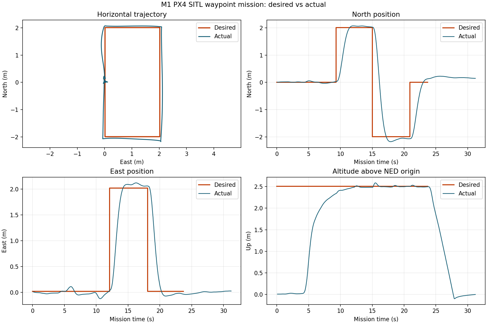

# ROS2 无人机自主巡检系统

基于 PX4、ROS 2 和 Gazebo 的无人机自主巡检项目。项目范围、架构和里程碑以 [`项目方案-ROS2无人机自主巡检系统.md`](项目方案-ROS2无人机自主巡检系统.md) 为准。

## 当前状态

当前里程碑：**M2 - 感知与局部建图（待实施）**。

2026-08-22 已在本机直接验收 M0 和 M1：除 PX4/Gazebo/ROS 2 基线外，
一条 launch 命令可完成起飞、4 个方形航点、返回起点和自动降落。
6 个稳定到达点的平均位置误差为 `0.127 m`；每个目标段最后 1 秒共 300 个
稳态样本的平均误差为 `0.119 m`，RMSE 为 `0.133 m`。
直接证据和口径限制见 [`docs/m0-environment-audit.md`](docs/m0-environment-audit.md)
与 [`docs/m1-waypoint-audit.md`](docs/m1-waypoint-audit.md)。

## 固定版本

| 组件 | 版本 |
|---|---|
| Ubuntu | 22.04.5 LTS（WSL2） |
| ROS 2 | Humble |
| Gazebo | Harmonic 8.15.0 |
| PX4 Autopilot | v1.17.0 |
| px4_msgs | v1.17.0 |
| px4_ros_com | `86e9aeb20e55a4673fa8a9f1c29ea06a6c5ad1af` |
| Micro XRCE-DDS Agent | v2.4.3 |
| PlotJuggler | 3.17.2 |

版本锁定位于 [`dependencies.repos`](dependencies.repos)。不要单独升级其中一个 PX4 相关仓库。

## 仓库布局

```text
.
|-- .local/                  # 项目内工具与 Python 用户包（不提交）
|-- .wsl/                    # Ubuntu 22.04 WSL 数据（不提交）
|-- build/ install/ log/     # Colcon 输出（不提交）
|-- docs/
|-- external/                # PX4 与 Agent 外部源码（不提交）
|-- scripts/
|-- src/                     # Colcon 工作空间源码
`-- dependencies.repos
```

所有项目生成的下载、缓存、日志和临时文件均应留在仓库或项目内 WSL 中。`scripts/project-env.sh` 会隔离 Windows PATH，并将常见缓存和日志定向到项目目录。

## 从零搭建

以下步骤以 Windows PowerShell 当前目录为仓库根目录、仓库位于 E 盘为例。若路径不同，只需替换 WSL 中的仓库路径。

### 1. 安装项目内 WSL

在 PowerShell 中执行：

```powershell
wsl --install --distribution Ubuntu-22.04 --location "$((Get-Location).Path)\.wsl\Ubuntu-22.04"
wsl -d Ubuntu-22.04
```

首次进入 Ubuntu 时完成用户名和密码初始化。之后在 Ubuntu 中进入仓库并建立稳定挂载点：

```bash
cd "/mnt/e/codex-work space/project19-无人机开发agent"
bash scripts/mount-project.sh
cd /opt/project19
```

WSL 完全停止后 bind mount 会消失；每次重新启动 WSL 后先再次运行 `scripts/mount-project.sh`。

### 2. 安装 ROS 2 Humble

```bash
sudo apt-get update
sudo apt-get install -y curl software-properties-common
sudo add-apt-repository -y universe

mkdir -p downloads
curl -L \
  -o downloads/ros2-apt-source_1.2.0.jammy_all.deb \
  https://github.com/ros-infrastructure/ros-apt-source/releases/download/1.2.0/ros2-apt-source_1.2.0.jammy_all.deb
sudo apt-get install -y ./downloads/ros2-apt-source_1.2.0.jammy_all.deb
sudo apt-get update
sudo apt-get install -y \
  ros-humble-desktop \
  ros-humble-plotjuggler-ros \
  ros-humble-ros-gzharmonic \
  python3-colcon-common-extensions \
  python3-vcstool
```

### 3. 获取固定版本源码

```bash
cd /opt/project19
vcs import < dependencies.repos
```

`external/COLCON_IGNORE` 用于阻止 Colcon 扫描第三方源码，不要删除。

### 4. 安装 PX4 仿真依赖

```bash
cd /opt/project19
export PYTHONUSERBASE=/opt/project19/.local/python
export PIP_CACHE_DIR=/opt/project19/.cache/pip
bash external/PX4-Autopilot/Tools/setup/ubuntu.sh --no-nuttx
```

重新打开 Ubuntu 终端后继续。`--no-nuttx` 只跳过本阶段不需要的真机交叉编译工具链，不影响 SITL。

### 5. 构建 Micro XRCE-DDS Agent

```bash
cd /opt/project19
cmake \
  -S external/Micro-XRCE-DDS-Agent \
  -B .cache/micro-xrce-dds-agent-build \
  -DCMAKE_BUILD_TYPE=Release \
  -DCMAKE_INSTALL_PREFIX=/opt/project19/.local/micro-xrce-dds-agent
cmake --build .cache/micro-xrce-dds-agent-build --target install -j "$(nproc)"
```

### 6. 构建 ROS 2 工作区

```bash
source /opt/project19/scripts/project-env.sh
colcon build --symlink-install
```

当前预期构建 4 个包：`px4_msgs`、`px4_ros_com`、`drone_controller` 和
`drone_bringup`：

```text
Summary: 4 packages finished
```

可执行上游测试：

```bash
colcon test --event-handlers console_direct+
colcon test-result --verbose
```

固定版本的 `px4_ros_com` 自身不满足 Humble 默认 lint 规则，当前结果为 `692 tests, 0 errors, 672 failures, 7 skipped`。这些是未修改上游源码的格式、版权和静态检查失败，不代表项目测试全绿；详见 M0 审计。

仅验证项目自有包时使用：

```bash
colcon test --packages-select drone_controller drone_bringup \
  --event-handlers console_direct+
colcon test-result --test-result-base build/drone_controller --verbose
colcon test-result --test-result-base build/drone_bringup --verbose
```

当前项目结果为：`drone_controller` 9 tests、`drone_bringup` 10 tests，均为
0 errors、0 failures、0 skipped；其中分别包含 8 个 GTest 和 9 个 pytest 用例。

## M0 运行验收

每个新 Ubuntu 终端都先执行：

```bash
source /opt/project19/scripts/project-env.sh
```

### 终端 1：启动 DDS Agent

```bash
MicroXRCEAgent udp4 -p 8888
```

看到 `running... | port: 8888` 后保持运行。

### 终端 2：启动 PX4 SITL

```bash
HEADLESS=1 make -C external/PX4-Autopilot px4_sitl gz_x500
```

看到 `pxh>` 后，可用以下命令确认 DDS：

```text
uxrce_dds_client status
```

无 QGroundControl 的纯本地仿真会被 GCS 丢失保护阻止解锁。仅在本机 SITL 中执行：

```text
param set NAV_DLL_ACT 0
commander takeoff
commander status
listener vehicle_local_position -n 1
commander land
```

不要把 `NAV_DLL_ACT=0` 用于真机。命令行起飞默认高度约 2.5 m，降落后应看到 `Disarmed by landing`。

### 终端 3：验证 ROS 2 里程计

```bash
ros2 topic echo --once /fmu/out/vehicle_odometry
```

命令应输出一帧包含 `position`、`q` 和 `velocity` 的消息并以状态码 0 结束。

### 终端 3：运行官方 Offboard 例程

先确保飞行器已经降落并解除武装，然后运行：

```bash
ros2 run px4_ros_com offboard_control
```

示例会切换至 Offboard、解锁并将 NED 位置设为 `(0, 0, -5)`。在 PX4 控制台中验证：

```text
commander status
listener vehicle_local_position -n 1
```

预期导航模式为 `Offboard`，`z` 接近 `-5 m` 且速度接近零。结束时先在 PX4 控制台输入 `commander land`，再停止 Offboard 节点，并等待 `Landing detected` 与 `Disarmed by landing`。

## M0 验收结果

- [x] `gz_x500` SITL 启动并完成命令行起飞/降落
- [x] ROS 2 收到 `/fmu/out/vehicle_odometry`
- [x] 官方 C++ Offboard 例程起飞至 5 m 并稳定悬停
- [x] 本 README 记录从零环境搭建和复现步骤

## M1 一键航点任务

每次 WSL 重启后先恢复项目挂载并加载环境：

```bash
cd "/mnt/e/codex-work space/project19-无人机开发agent"
bash scripts/mount-project.sh
source /opt/project19/scripts/project-env.sh
```

随后只需一条命令：

```bash
ros2 launch drone_bringup waypoint_mission.launch.py
```

该 launch 先校验项目内 Micro XRCE-DDS Agent 与 PX4 依赖，再同时启动 Agent、
使用官方 `-d` 模式的 PX4 `gz_x500` SITL、
航点控制节点和 rosbag 记录器。`NAV_DLL_ACT=0` 通过本次 PX4 SITL 进程的环境
变量设置，仅用于无 QGroundControl 的本地仿真，不会写入真机配置。任务完成或
失败后，控制节点给出明确退出状态，launch 再停止其余进程。

默认任务参数位于 `src/drone_bringup/config/waypoint_mission.yaml`：相对起点
上升 2.5 m，依次飞过 `(2,0)`、`(2,2)`、`(-2,2)`、`(-2,0)` 四个偏移
航点，再返回起飞点上方并自动降落。目标使用 PX4 的 NED 坐标系。

可选 launch 参数：

```bash
# 已经在其他终端启动 Agent 和 SITL 时
ros2 launch drone_bringup waypoint_mission.launch.py start_simulation:=false

# 调试时关闭 rosbag
ros2 launch drone_bringup waypoint_mission.launch.py record_bag:=false
```

rosbag 默认写入 `log/m1/trajectory_YYYYMMDD_HHMMSS/`。用 PlotJuggler 打开
其中的绝对 `metadata.yaml` 路径，并载入 `docs/m1-waypoint-layout.xml`，可复现
期望 North 与实际 North 的叠加曲线。也可用项目脚本生成下图和本地 GIF：

```bash
export PYTHONNOUSERSITE=1
python3 scripts/plot_m1_trajectory.py \
  log/m1/trajectory_20260822_051355 \
  docs/assets/m1-trajectory.png \
  --animation log/m1/m1-waypoint-flight.gif \
  --metrics docs/assets/m1-tracking-metrics.json
```



本次直接验收结果：

- 4/4 巡检航点全部稳定到达，随后返回起点上方
- PX4 执行自动降落并输出 `Disarmed by landing`
- 300 个稳态样本平均误差 `0.119 m`，RMSE `0.133 m`，最大 `0.273 m`
- 包含航点阶跃及机动过渡的 1181 个全任务样本平均误差 `1.206 m`
- rosbag 时长 `31.210 s`，包含 1913 条消息
- 项目包构建无编译警告，包级测试全绿
- 顶层 launch 状态码为 0，结束后无 Agent、PX4、Gazebo、控制器或 rosbag 残留

验收阈值采用每个目标段最后 1 秒的稳态样本。全任务误差包含目标阶跃瞬间和
机动过程，因此显著更大；两种口径均保留在
`docs/assets/m1-tracking-metrics.json`，完整限制见 M1 审计。

## M1 验收结果

- [x] 一条命令自主完成起飞、4 个航点、返航和降落
- [x] 稳态航点误差已量化，300 个样本平均值 `0.119 m`，小于 0.3 m
- [x] 项目代码构建无警告，航点判断逻辑有单元测试
