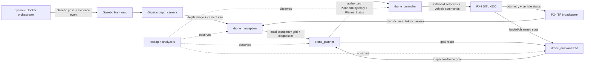

# 系统架构与模块设计 / Architecture and Module Design

## 总体数据流 / End-to-End Data Flow

中文：系统将感知、规划、控制和任务编排拆成独立 ROS 2 包。任务状态机只发布目标
与任务命令，不绕过规划器直接控制飞行器；控制器只跟踪带有效授权的新鲜轨迹。

English: Perception, planning, control, and mission orchestration are separate
ROS 2 packages. The mission FSM publishes goals and mission commands but never
bypasses the planner to command motion. The controller follows only fresh,
authorized trajectories.

## 模块职责 / Module Responsibilities

### `drone_interfaces`

- 定义 `PlannedTrajectory`、`PlannerStatus`、`MissionCommand` 和 `MissionEvent`
- 将轨迹 ID、地图新鲜度、状态转换序号和异常原因变成显式接口字段
- Owns the cross-package message contracts and keeps safety-relevant state
  machine evidence machine-readable

### `drone_sim`

- 提供巡检 world、墙体、立柱、货架、门和动态障碍物模型
- Gazebo contacts topic 用于独立碰撞证据，不以控制器内部判断代替真实接触消息
- Owns the fixed inspection world and collision-observation surface

### `drone_perception`

- 将深度图按 `camera_optical_frame` 投影到 `map` 下的滚动二维占据栅格
- 发布处理频率、延迟和输入状态诊断
- 维护 `map -> base_link -> camera_optical_frame` 的 M2 已验收 TF 契约
- Rejects unusable transforms instead of publishing a falsely aligned map

### `drone_planner`

- 将占据栅格转换为带膨胀安全边界的网格
- 用 A* 搜索并平滑离散路径，发布单调递增轨迹 ID
- 在地图陈旧、目标不可达或轨迹不安全时显式拒绝授权
- Replans when the active path becomes obstructed and exposes status for
  independent timing analysis

### `drone_controller`

- 管理 PX4 Offboard 心跳、解锁、位置/轨迹 setpoint 和降落命令
- M4 模式下只接受与当前目标匹配、未过期且经规划器授权的轨迹
- 保留 M1 直接航点模式，但 M3/M4 行为必须显式启用，避免破坏早期契约
- Stops motion authorization when map or trajectory evidence becomes stale

### `drone_mission`

- 状态：`STANDBY -> TAKEOFF -> INSPECTING -> HANDLING_EXCEPTION -> RETURNING_HOME -> LANDING -> COMPLETE`
- 不可达点在持续超时且证据匹配当前目标后跳过
- 低电量立即停止剩余巡检，按已成功航点倒序回撤，再返回 home
- Publishes a strictly increasing event sequence for every state or progress
  transition

### `drone_bringup`

- 组合 Gazebo、DDS Agent、PX4、感知、规划、控制、任务节点、RViz 和 rosbag
- 固定各里程碑参数并集中测试 launch/配置/证据分析工具
- Treats unexpected required-process exits as top-level launch failures

## 关键契约 / Safety-Critical Contracts

| Contract | Producer | Consumer | Enforcement |
|---|---|---|---|
| `map` occupancy grid freshness | `drone_perception` | `drone_planner` | Planner rejects maps older than its configured age limit |
| TF alignment | PX4 TF broadcaster | Perception/planner/evidence | Required frames and timestamp proximity are checked |
| Goal identity | `drone_mission` | Planner/controller/analyzer | Coordinates and goal sequence must match the active mission target |
| Trajectory authorization | `drone_planner` | `drone_controller` | Valid status, fresh map, matching trajectory ID, collision-free path |
| Landing completion | PX4/controller | Mission/analyzer | LAND follows home; landed and disarmed precede `COMPLETE` |
| Collision evidence | Gazebo contacts | Analyzer | Topic must exist and contain zero x500 collision messages |

## 运行部署 / Deployment Views

Native WSL uses the repository bind-mounted at `/opt/project19`; all caches,
build output, dependencies, bags, and logs remain below that project root. The
Docker image uses the same internal root, embeds pinned source dependencies and
build output, and bind-mounts only `./log` for runtime evidence.

`compose.yaml` provides two deployment modes:

- `inspection`: default headless M4 mission for deterministic reproduction
- `inspection-gui`: opt-in Linux X11 profile for Gazebo and RViz inspection

Neither mode represents real-hardware deployment. M6 requires HITL and separate
real-flight safety review.
